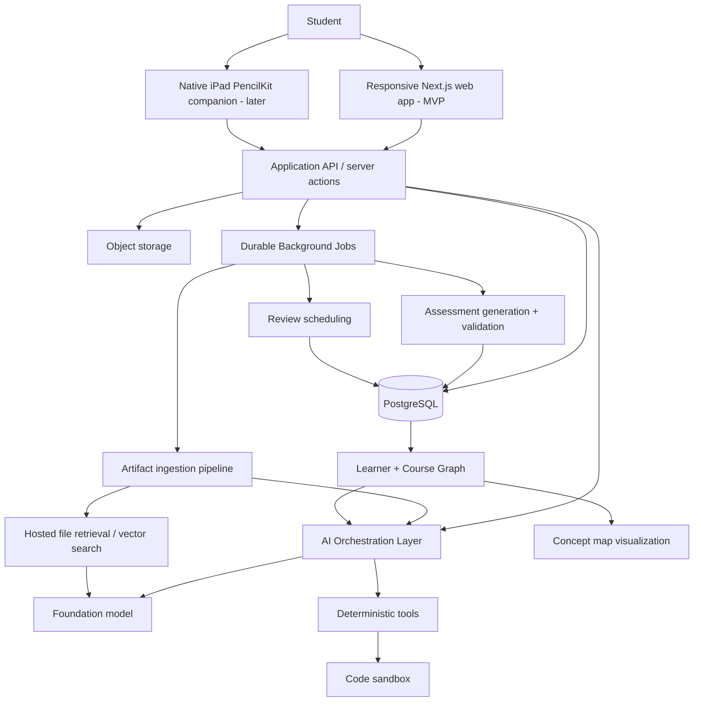
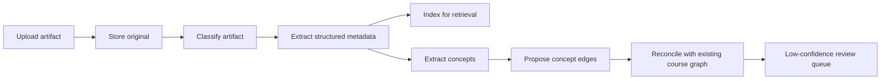
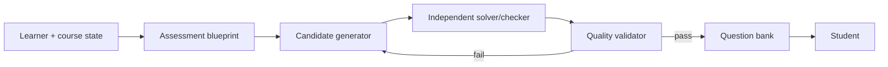

# AI Learning System — Technical Product Requirements Document

**Status:** Draft for product/architecture review  
**Date:** 2026-08-31  
**Document type:** Technical PRD / system-design proposal  
**Companion document:** `ai_learning_project_summary.md`  
**Primary design goal:** Build the smallest technically credible system that proves persistent learner modeling, concept-relationship mastery, course-grounded assessment generation, multimodal grading, and adaptive review.

> **Format note.** Google does not publish one canonical public PRD template that all teams use. This document adapts the structure and writing style encouraged in Google's public engineering documentation: clear problem/context, goals and non-goals, explicit requirements and tradeoffs, measurable success criteria, alternatives, risks, and a maintained decision log. Google also recommends keeping design docs concise, current, and useful rather than duplicating existing documentation. See [R1–R3].

---

## 1. Executive summary

The product is an AI-native learning system that maintains a persistent, evidence-based model of a student's understanding across a course. It ingests course materials and study artifacts, maps concepts and their relationships, observes evidence from conversations and assessments, schedules retrieval and integration practice, and generates increasingly exam-like practice as assessments approach.

The system's technical differentiation is **not** a proprietary foundation model. It should deliberately reuse strong existing models and solved infrastructure. The custom engineering should concentrate on four areas:

1. **Learner graph:** a persistent graph representing concepts, meaningful relationships, misconceptions, and evidence of mastery.
2. **Assessment pipeline:** course-grounded problem generation with validation, deterministic verification where possible, and modality-aware grading.
3. **Learning policy:** selecting what to test, when, and with how much assistance using retrieval, spacing, interleaving, and transfer-oriented practice.
4. **Concept-map experience:** a non-generic visualization that helps students understand how units fit together and where their own knowledge is fragmented.

The proposed MVP uses a TypeScript-first web stack, PostgreSQL, managed authentication/storage, OpenAI's current Responses/Agents primitives, durable background jobs, and existing graph/handwriting libraries rather than training models or building infrastructure from scratch.

---

## 2. Problem statement

Students already produce substantial learning evidence: lecture notes, homework, questions, code, diagrams, practice attempts, annotations, and conversations with AI. Existing tools often require students to manually convert that work into flashcards or treat each interaction as an isolated session.

The technical problem is to convert existing course artifacts and student interactions into a trustworthy, evolving representation of:

- what the course teaches and emphasizes;
- what the student has been exposed to;
- what the student can independently retrieve;
- what the student can apply or transfer;
- what relationships between concepts the student understands;
- what misconceptions or unresolved confusion signals remain;
- what should be reviewed next.

The system must do this without adding large amounts of bookkeeping and without allowing the AI layer to fabricate course facts, overstate mastery, or confidently grade ambiguous work.

---

## 3. Product principles translated into engineering constraints

### P1. Remove logistical friction; preserve productive learning friction

**Engineering implication:** automate ingestion, organization, concept extraction, scheduling, and practice selection. Do not automatically reveal answers when retrieval or a small hint is pedagogically more valuable.

Retrieval practice has strong evidence relative to restudy, and recent meta-analysis continues to support retrieval practice as a learning mechanism. Spacing also shows benefits in mathematics and other educational contexts. [R4–R6]

### P2. Exposure is not mastery

**Engineering implication:** conversations, note uploads, and completed homework create low-confidence `exposure` evidence by default. Stronger mastery evidence requires independent retrieval, application, transfer, or validated performance.

Knowledge tracing research models mastery from histories of learner interactions rather than treating content exposure as mastery. [R7–R9]

### P3. Relationships are first-class learning objects

**Engineering implication:** an edge such as `FIFO queue -> BFS level ordering` is persisted, assessed, and assigned its own evidence state. The graph is not merely a navigation structure.

Concept-map research has found benefits for retention and transfer, and concept maps have also been used as instruments for assessing conceptual knowledge. [R10–R12]

### P4. Foundation models reason; deterministic software verifies whenever possible

**Engineering implication:** use an LLM for interpretation, generation, pedagogy, and ambiguous grading. Use executable tools for code, data-structure state, graph traversal, boolean logic, numeric/symbolic math, and other domains where an exact checker can be written.

### P5. Course grounding is mandatory for course-specific claims

**Engineering implication:** questions, answer keys, explanations labeled as course-specific, and exam-style practice must carry source anchors to uploaded course material whenever such material exists.

### P6. The learner graph must be comprehensible, not merely complete

**Engineering implication:** avoid a single force-directed network containing every concept. The graph uses hierarchical units, semantic edge types, progressive disclosure, stable layout, and multiple zoom levels.

---

## 4. Goals and non-goals

### 4.1 MVP goals

The MVP must prove the following end-to-end loop:

1. A student creates a course and uploads course materials.
2. The system extracts concepts and proposes a course graph.
3. The student can inspect the proposed graph and report suspected duplicates/errors, but cannot directly mutate the canonical course ontology in the MVP.
4. The student has a grounded tutoring conversation.
5. The system records exposure or misconception evidence from the conversation without automatically declaring mastery.
6. The system selects a concept or relationship for review.
7. It generates a course-relevant question from a structured assessment blueprint.
8. It validates the question before showing it.
9. The student answers using text, code, or one constrained visual modality.
10. The answer is graded through an appropriate verification pipeline.
11. Evidence updates the learner graph.
12. The concept map visibly changes and explains why.
13. A review scheduler generates a short daily session and a longer exam-prep session.

### 4.2 MVP non-goals

The MVP will **not**:

- replace Goodnotes or Notion as a note-taking application;
- provide real-time sync with every third-party study tool;
- support arbitrary handwritten-diagram grading;
- train a proprietary foundation model or handwriting model;
- implement a graph database unless PostgreSQL becomes demonstrably inadequate;
- infer psychological mastery with research-grade accuracy;
- predict actual exam questions;
- automatically submit homework;
- provide solutions to graded work in ways that undermine academic-integrity policies;
- support all academic disciplines equally well.

### 4.3 Post-MVP targets

- Native iPad drawing experience with Apple Pencil.
- Notion OAuth + webhook synchronization.
- Goodnotes ingestion through automatic cloud backup.
- Canvas ingestion for assignments/submissions/feedback where authorized.
- VS Code extension for opt-in learning evidence from coding friction.
- More visual answer types: FSMs, pipelines, waveforms, circuits.
- More formal learner-model calibration based on accumulated usage data.

---

## 5. Target user and initial domain scope

### Primary MVP user

An undergraduate CS/Computer Engineering student who:

- uses lecture notes, homework, and AI explanations;
- studies for cumulative technical exams;
- struggles to remember material after initially understanding it;
- wants to understand connections across units;
- works with code, graphs, trees, state diagrams, or architecture diagrams.

### Initial subject coverage

Use **data structures/algorithms** as the primary MVP domain, with **bounded symbolic/numeric math** as a secondary domain and selected computer architecture/digital logic after the core visual loop is trustworthy.

Reasons:

- Data structures/algorithms has structured, machine-checkable states and an especially reliable first visual loop for graphs/trees.
- Bounded math can be represented structurally and checked symbolically/numerically without attempting arbitrary proof grading.
- These domains exercise text, code, equations, and constrained visual assessment.
- Computer architecture/digital logic remains a strong next domain once the grading pipeline is proven.

---

## 6. Success criteria

### 6.1 Product success metrics

For early dogfooding/user testing:

- **Setup friction:** median time from account creation to first usable course graph < 10 minutes after files are uploaded.
- **Graph usefulness:** >= 70% of test users can correctly explain at least one cross-unit relationship they had not previously articulated after using the graph/review experience.
- **Question acceptance:** >= 90% of generated questions pass automated validation; >= 80% of human-reviewed questions are judged course-relevant and unambiguous.
- **Grading agreement:** >= 90% agreement with human labels on deterministic/code/structured-visual tasks; >= 80% on rubric-based conceptual responses in the initial benchmark.
- **Low overhead:** normal non-exam review defaults to <= 10 minutes/day.
- **Retention signal:** repeated retrieval performance at delayed intervals improves relative to first attempt for dogfood users; do not claim causal learning improvement until a controlled study exists.

### 6.2 Technical SLO candidates

- Interactive tutor first token: p95 < 3 seconds when no long background processing is required.
- Course-material retrieval: p95 < 1.5 seconds for a typical course collection.
- Background document ingestion: 95% complete within 5 minutes for a normal lecture PDF; report status rather than block UI.
- No silent learner-state mutation after failed grading/generation jobs.
- Every learner-state update must retain a traceable evidence record and source/assessment ID.

Google's SRE guidance recommends precise, measurable SLO definitions and explicit caveats/tradeoffs; use these as draft targets until real measurements exist. [R3]

---

## 7. Product surface and client strategy

### 7.1 MVP product surface: responsive web application

**Decision:** ship the MVP as a responsive **web application**, not as a desktop application or native iPad application.

The web app is the primary product and should contain the complete learning workflow:

- account and course dashboard;
- artifact upload and ingestion status;
- concept atlas / learner graph;
- grounded tutor chat;
- review sessions;
- exam planning and readiness;
- text, code, structured graph/tree, and bounded-math assessments;
- settings and learner-history controls.

Rationale:

- one client reaches laptops, tablets, and phones without duplicating product logic;
- Next.js/React is already the strongest fit for the graph-rich interface and chat/review surfaces;
- course ingestion, learner-state updates, scheduling, and integrations are server-side concerns and do not require a local desktop process;
- the concept atlas benefits from laptop/desktop screen area, but remains usable on iPad through the responsive web client;
- the core product thesis can be validated before maintaining Swift and desktop codebases.

### 7.2 Post-MVP iPad companion

A native iPad client becomes justified when Apple Pencil input materially improves assessment quality and study behavior. It should be a **focused companion**, not a second full product.

Initial native scope:

- authenticate into the same account;
- open today's review or a selected practice session;
- answer visual/math questions with PencilKit;
- preserve stroke geometry, ink/highlighter metadata, and rendered images;
- submit to the same backend grading/evidence pipeline;
- receive feedback and immediately see updated learner state.

The course atlas may remain web-first unless user testing shows a native graph experience is necessary.

### 7.3 Desktop application: defer

Do **not** build an Electron/Tauri desktop app for MVP. A desktop client becomes justified only if the product later requires capabilities that a browser cannot provide cleanly, such as:

- persistent local-folder watching;
- deep filesystem integration;
- always-running local background agents;
- OS-level shortcuts/overlays;
- richer IDE/local-development telemetry than a VS Code extension can provide.

Notion, Canvas, Google Drive, cloud-folder ingestion, scheduled reviews, and most Goodnotes-sync flows can be handled by server-side integrations without a desktop client.

### 7.4 Client architecture principle

All canonical course, learner, assessment, and graph state lives in backend services. Clients are views/controllers over shared APIs. Therefore a future iPad or desktop client does not require migration of the learning model.

```text
                     shared backend
                          │
             ┌────────────┼────────────┐
             ▼            ▼            ▼
        Web app       iPad app      Desktop/IDE
       MVP/full        later          optional
       product        drawing        integrations
```

---

## 8. High-level system architecture



### Architectural principle

Use a **modular monolith + managed background worker** for MVP. Do not introduce microservices. AI pipelines can be separate modules/tasks without separate deployable services.

---

## 9. Proposed technology stack

### 9.1 Web application

**Recommendation:** Next.js + React + TypeScript.

Rationale:

- Suitable for dashboard, chat, upload, graph, and assessment UI.
- Allows shared TypeScript schemas between UI, API, background jobs, and OpenAI tool definitions.
- Avoids an unnecessary Python service unless a later ML library requires it.

### 9.2 Database, authentication, and object storage

**Recommendation:** Supabase for MVP.

Use:

- managed PostgreSQL;
- Supabase Auth;
- Supabase Storage for uploaded source files and drawings;
- row-level security for user/course isolation.

Supabase provides a full Postgres instance and integrates Auth with Postgres; its SDK handles token persistence/refresh, while Postgres RLS can protect application data. [R13–R14]

**Do not add Neo4j in MVP.** Store graph data relationally:

- `concepts`
- `concept_edges`
- `evidence`
- `source_anchors`

PostgreSQL can represent adjacency lists, query neighborhoods, and support recursive CTEs. A dedicated graph DB is not justified until graph traversals become a demonstrated bottleneck or the data model requires graph-native transactional semantics.

### 9.3 Semantic retrieval

**MVP recommendation:** OpenAI hosted File Search / vector stores for course-material retrieval, while keeping canonical file/source metadata in Postgres.

OpenAI's Responses API supports file-search tool calls and structured outputs, reducing the need to build chunking, embeddings, vector indexing, and retrieval infrastructure initially. [R15–R17]

**Alternative:** Supabase `pgvector` if greater control over chunking/ranking or provider portability becomes important. Supabase supports the pgvector extension for embeddings and vector similarity. [R18]

**Decision:** hosted file search first; abstract retrieval behind a `CourseRetriever` interface so it can later be replaced.

### 9.4 AI orchestration

**Recommendation:** OpenAI Agents SDK for the tutor/review agent + Responses API primitives.

Useful existing capabilities:

- agents with instructions and tools;
- structured outputs;
- guardrails;
- built-in tracing;
- file search;
- image/file inputs;
- function tools.

The Agents SDK explicitly supports agents, tools, guardrails, handoffs, and tracing; tool calls can wrap application functions. [R19–R22]

**Architecture rule:** use one primary tutor/review agent initially. Do not create multiple named agents merely to claim a multi-agent architecture.

### 9.5 Background jobs and schedules

**Recommendation:** Trigger.dev for MVP.

Required background operations include:

- document ingestion;
- concept extraction/reconciliation;
- question generation/validation;
- daily review selection;
- exam-plan generation;
- future integration sync jobs.

Trigger.dev provides long-running tasks, retries, queues, cron schedules, checkpointing, and observability without managing queue/worker infrastructure. [R23–R25]

**Alternative later:** Temporal if workflow scale/complexity justifies a heavier durable-execution system.

### 9.6 Code execution and deterministic checking

**Recommendation:** E2B sandbox for untrusted student/generated code where local deterministic functions are insufficient.

E2B provides isolated cloud sandboxes that can run code and commands. [R26–R27]

For simple algorithm questions, prefer internal pure functions over starting a sandbox.

### 9.7 Handwriting and digital ink

**MVP:** image upload + multimodal model for constrained visual tasks.

**Post-MVP iPad:** PencilKit `PKCanvasView` for low-latency Apple Pencil/finger input; preserve both `PKDrawing` stroke data and rendered image. PencilKit exposes drawings, strokes, stroke paths, and stroke points. [R28–R30]

**Math handwriting:** Mathpix Digital Ink API accepts stroke-oriented input and provides live handwritten math recognition. [R31]

Do not train handwriting recognition.

---

## 10. Core domain model

### 10.1 Renderer-neutral graph storage model

The persistent model SHALL be independent of any graph renderer. PostgreSQL stores normalized semantic entities and learner/evidence records; a canonical node-link DTO is constructed at the API boundary.

Core tables:

```text
courses
units
concepts
concept_aliases
concept_edges
edge_source_anchors
artifact_concept_mentions
artifact_edge_mentions
learner_concept_state
learner_edge_state
evidence_events
graph_revisions
graph_layouts
```

#### Concept data required

- stable `id`;
- `course_id`;
- canonical name;
- aliases/source-specific terminology;
- normalized description;
- unit membership;
- course-importance signal;
- source provenance;
- ontology confidence/status.

#### Relationship data required

- stable `id`;
- source and target concept IDs;
- standardized semantic type;
- directionality;
- short normalized explanation;
- course-source provenance;
- ontology confidence/status.

Model the semantic layer as a **multigraph** so multiple valid relationship types can exist between the same concept pair. Do not infer uniqueness from `(source, target)` alone.

#### Learner overlay required

Store learner concept state and learner relationship state independently. A learner may have strong mastery of both endpoint concepts but fragile evidence for the relationship between them.

#### Layout/view state required

Store coordinates and renderer/view configuration separately:

```text
graph_layouts
- course_id
- view_key
- entity_id
- renderer
- layout_algorithm
- x / y / width / height
- collapsed
- revision
```

Semantic nodes/edges SHALL NOT contain authoritative `x`, `y`, CSS color, React component type, Cytoscape class, or G6 combo configuration.

#### Canonical DTO

Expose a typed node-link representation conceptually similar to:

```ts
type CourseGraph = {
  version: number;
  courseId: string;
  units: Unit[];
  nodes: ConceptNode[];
  edges: ConceptEdge[];
  learnerState?: {
    concepts: Record<string, LearnerConceptState>;
    edges: Record<string, LearnerEdgeState>;
  };
};
```

Adapters convert this DTO to React Flow, G6, Cytoscape, Sigma, ELK, GraphML, or future visualization formats.

### 10.2 Course graph vs learner graph

Do not collapse these into one graph.

#### Course graph

Represents what the course teaches.

`CourseConcept`

- `id`
- `course_id`
- `canonical_name`
- `description`
- `unit_id`
- `importance_score`
- `source_confidence`
- `status`: proposed | confirmed | archived

`ConceptEdge`

- `source_concept_id`
- `target_concept_id`
- `relation_type`
- `course_confidence`
- `explanation`
- `source_anchors[]`

Initial edge types:

- `prerequisite_for`
- `part_of`
- `mechanism_for`
- `contrasts_with`
- `used_in`
- `generalizes_to`
- `example_of`

#### Learner graph

Overlays student-specific state on concepts **and relationships**.

`LearnerConceptState`

- `user_id`
- `concept_id`
- `exposure_score`
- `retrieval_score`
- `application_score`
- `transfer_score`
- `retention_confidence`
- `last_verified_at`
- `next_review_at`
- `unresolved_misconception_count`

`LearnerEdgeState`

- `user_id`
- `edge_id`
- `connection_score`
- `last_verified_at`
- `evidence_count`

### 10.3 Evidence event

Every learner-state change must trace back to immutable evidence.

`EvidenceEvent`

- `id`
- `user_id`
- `course_id`
- `concept_ids[]`
- `edge_ids[]`
- `evidence_type`
- `correctness`
- `grader_confidence`
- `assistance_level`
- `difficulty`
- `transfer_distance`
- `student_confidence` (optional)
- `source_artifact_id` (optional)
- `assessment_attempt_id` (optional)
- `conversation_turn_id` (optional)
- `created_at`

Evidence types:

- `exposure`
- `retrieval`
- `explanation`
- `application`
- `transfer`
- `relationship_explanation`
- `misconception`
- `annotation_confusion_signal`
- `instructor_feedback`

### 10.4 Initial learner-state algorithm

Do **not** start with deep knowledge tracing. There is insufficient product data to calibrate it.

Start with an interpretable weighted evidence model:

```text
state_dimension = weighted_average(
  evidence_strength
  * recency_decay
  * independence_factor
  * grader_confidence
  * difficulty_factor
)
```

Example relative evidence strengths:

- AI explanation viewed: low exposure only.
- Homework completed: low/medium exposure/application, depending on verification.
- Correct independent retrieval: strong retrieval.
- Correct novel application: strong application.
- Correct transfer with no hint: strongest transfer.
- Repeated confident misconception: negative evidence.

The exact weights are product parameters, not psychological truths. Log all components so later usage data can support calibration or Bayesian/deep knowledge tracing. Knowledge-tracing literature provides a mature future path, but using a complex model before collecting domain data would create false precision. [R7–R9]

---

## 11. Course ingestion pipeline

### 11.1 Supported MVP inputs

- PDF lecture slides/notes
- syllabus
- homework PDFs
- practice exams
- images/screenshots of handwritten notes
- pasted text/code

### 11.2 Pipeline



### 11.3 Artifact classification schema

```json
{
  "artifact_type": "lecture|homework|practice_exam|syllabus|notes|graded_work",
  "course_id": "...",
  "title": "...",
  "unit": "...",
  "date": "...",
  "confidence": 0.0
}
```

### 11.4 Concept extraction requirements

The model must return strict structured output:

- concept name;
- normalized description;
- candidate unit;
- importance signal;
- evidence excerpts/source anchors;
- relation candidates;
- confidence;
- whether it appears new or maps to an existing concept.

Structured Outputs can enforce JSON shape, but schema adherence does not guarantee semantic correctness; therefore graph mutation must remain confidence-gated. [R15–R17]

### 11.5 Homework interpretation

Homework contributes primarily to:

- course emphasis;
- question-format taxonomy;
- concept co-occurrence;
- difficulty/style examples.

Completed homework does not automatically yield high mastery evidence.

Graded instructor feedback, if uploaded, should be extracted separately as potentially strong misconception evidence.

---

## 12. Concept graph construction and reconciliation

### 12.1 Why this is a hard custom component

Course documents will refer to the same concept under different names and levels of granularity. Example:

- "BFS"
- "breadth-first search"
- "graph traversal using queue"

The system needs controlled deduplication without flattening legitimately distinct concepts.

### 12.2 Proposed reconciliation flow

1. Extract candidate concepts from each artifact.
2. Retrieve semantically similar existing concepts.
3. Ask model for one of:
   - `same_concept`
   - `parent_child`
   - `related_but_distinct`
   - `unrelated`
4. Auto-merge only above a conservative threshold.
5. Queue ambiguous merges for conservative system/internal review; do not ask the learner to become the ontology source of truth.
6. Let students flag `possible duplicate`, `wrong relationship`, or `confusing label` without directly changing canonical nodes/edges.
7. Preserve aliases and source-specific terminology so a course can use professor-specific naming without losing canonical mappings.

### 12.3 Edge provenance

Every relation must store:

- source artifact(s);
- model rationale;
- confidence;
- optional instructor confirmation or learner issue report (stored as feedback, not canonical truth).

This prevents the visualization from becoming a hallucinated graph.

---

## 13. Concept-map visualization design

### 13.1 Product requirement

The concept map is a primary learning surface, not analytics decoration.

It must answer:

1. **Where am I in the course?**
2. **How do units connect?**
3. **Which concepts are prerequisites/mechanisms/applications of others?**
4. **What do I understand vs merely recognize?**
5. **Which connections are weak?**
6. **What should I learn/review next?**

### 13.2 Do not use one generic force-directed graph

Large force-directed graphs create visual hairballs, move unpredictably, and obscure hierarchy. Instead use **semantic zoom + hierarchical regions**.

#### Zoom level 0 — Course landscape

Display course units as large regions/containers:

```text
[Foundations] ---> [Trees] ---> [Graphs] ---> [Advanced Graph Algorithms]
      \                            /
       --------> [Complexity] ----
```

The goal is big-picture orientation.

#### Zoom level 1 — Unit concept map

Expand one or two units. Show concepts, prerequisite chains, and the most meaningful cross-unit bridges.

#### Zoom level 2 — Concept evidence

Click a concept to reveal:

- mastery dimensions;
- source anchors;
- misconceptions;
- evidence history;
- related edges;
- next review reason.

### 13.3 Visual encodings

Proposed encodings:

- **Node interior:** concept mastery composite.
- **Outer ring:** retention confidence / forgetting risk.
- **Node badge:** unresolved misconception or explicit annotation signal.
- **Edge thickness:** learner's demonstrated connection strength.
- **Edge style/icon:** semantic relationship type.
- **Region:** course unit/module.
- **Dimming:** concepts outside current exam scope.
- **Glow/highlight:** today's recommended review path.

Do not encode more than 3–4 simultaneous dimensions at the overview level; expose details on selection.

### 13.4 Preserve the mental map

Persist node positions after initial layout. Incremental graph updates should avoid completely re-laying out the graph, because spatial stability helps users learn where concepts live.

### 13.5 Renderer-independent graph architecture

The concept atlas must not store semantic truth in React Flow, Cytoscape, G6, ELK, or any other visualization-library schema. The backend SHALL expose a renderer-neutral **labeled property graph** with stable node/edge IDs, typed relationships, grouping metadata, learner overlays, and provenance. Visualization-library-specific shapes are produced only by adapters.

Canonical layers:

1. **Semantic course graph** — concepts, units, aliases, typed concept relationships, course importance, provenance, confidence.
2. **Learner overlay** — concept state and relationship state derived from evidence.
3. **Evidence/provenance** — immutable records explaining why a state or ontology decision exists.
4. **View/layout state** — positions, collapsed regions, camera state, and renderer-specific preferences, stored separately from semantic data.

This separation permits the same course data to later power a bounded-region atlas, prerequisite tree, matrix, chronology view, weak-bridge view, or large-scale network without migrating the semantic model.

### 13.6 In-memory graph abstraction: Graphology

**Recommendation:** use Graphology as the optional in-memory TypeScript graph representation between the canonical graph service and visualization/analysis adapters. Graphology supports directed, undirected, and mixed graphs; parallel edges/multigraphs; typed node/edge attributes; and JSON import/export. [R51–R53]

Use it for reusable graph operations such as:

- neighborhoods and traversal;
- topological/dependency analysis;
- connected-component / knowledge-island detection;
- future centrality or clustering experiments;
- renderer-independent filtering and graph projections.

PostgreSQL remains the persistent source of truth. Do not persist one large Graphology JSON blob as the primary database record.

### 13.7 Recommended renderer: React Flow + ELK

**Recommendation:** prototype the MVP concept atlas with **React Flow** for interaction/rendering and **ELK/elkjs** for layout.

React Flow is a strong fit because the map is an application surface rather than a passive network visualization. It supports arbitrary React custom nodes and nested/sub-flow grouping, which maps naturally to mastery-ring concept cards inside bounded unit regions. [R37, R54–R55]

Use **ELK** as an independent layout engine for conceptual-dependency geometry. elkjs explicitly computes positions rather than owning rendering, and its layered algorithm is designed for directed node-link diagrams with inherent direction. [R35–R36, R56]

Target pipeline:

```text
PostgreSQL semantic graph
        ↓
Canonical CourseGraph DTO
        ↓
Graphology (analysis/filtering)
        ↓
ELK (layout positions/routing)
        ↓
React Flow adapter
        ↓
Concept atlas UI
```

### 13.8 Alternative renderers retained by design

#### AntV G6

Strong alternative if built-in group/combo behavior proves materially easier for bounded unit regions. Keep as prototype Plan B.

#### Cytoscape.js

Strong alternative when graph analysis and network semantics inside the renderer become more important than rich React-native concept cards. [R32–R34]

#### Sigma.js

Potential future renderer for very large graphs; Graphology is already designed to work as a graph data backend for browser renderers such as Sigma. [R38–R41, R51]

#### yFiles

Useful UX reference for high-quality hierarchical expand/collapse and incremental layout, but avoid as the default MVP dependency because it is commercial.

### 13.9 Visualization requirements already decided

- **Geometry:** conceptual dependency, not lecture chronology.
- **Units:** bounded regions/containers.
- **Relationships:** standardized semantic taxonomy rendered with readable labels plus edge shape/style; line-only semantics are insufficient.
- **Mastery:** discrete state plus progress ring; color remains a strong redundant cue (`fragile` red, `developing` amber, `strong` green, `unverified` neutral), never the sole cue.
- **Relationship mastery:** edges have their own learner state; a learner can know two concepts while having a fragile connection between them.
- **Selection:** concept click keeps the graph spatially stable, highlights the local neighborhood, dims unrelated content, and opens a side panel rather than expanding the node into a large card.
- **Study sets / homework / exam scope:** primarily filters or overlays on the semantic graph rather than pseudo-concept nodes.

---

## 14. Tutor agent architecture

### 14.1 Agent responsibilities

The tutor agent may:

- retrieve course sources;
- retrieve learner state;
- answer a student's question;
- ask a diagnostic/retrieval question before explaining;
- choose an assessment modality;
- request a visualization;
- record exposure/misconception candidates;
- escalate hints;
- propose review targets.

The agent may **not directly mutate mastery scores**.

All learner-state updates happen through validated evidence tools.

### 14.2 Agent tool surface

Initial tool set:

```text
search_course_materials(query, filters)
get_concept_state(concept_ids)
get_concept_neighbors(concept_id)
record_exposure(...)
record_misconception_candidate(...)
create_assessment_blueprint(...)
render_graph(...)
render_tree(...)
run_code_checker(...)
grade_structured_response(...)
commit_evidence(...)
```

### 14.3 Assistance ladder

The agent chooses the minimum useful intervention:

0. Ask student to retrieve/predict.
1. Ask a diagnostic question.
2. Give a conceptual cue.
3. Point to relevant course source or visual.
4. Explain the missing mechanism.
5. Give a partial worked example.
6. Give a complete answer.

The ladder is a product policy; it should be overridable when the student explicitly asks for a direct explanation.

---

## 15. Assessment generation pipeline

This is one of the project's highest-risk/highest-value components.

### 15.1 Never generate a question from one unconstrained prompt

Use a staged pipeline.



### 15.2 Assessment blueprint

Required fields:

```json
{
  "target_concepts": [],
  "target_edges": [],
  "assessment_type": "retrieval|mechanism|application|connection|transfer",
  "difficulty": 0,
  "course_style_refs": [],
  "required_prerequisites": [],
  "forbidden_concepts": [],
  "response_modality": "text|code|graph|tree|diagram",
  "expected_solution_properties": [],
  "max_time_minutes": 0
}
```

### 15.3 Candidate generation

The model receives:

- blueprint;
- relevant course examples retrieved from source material;
- learner misconceptions;
- explicit instruction not to copy source questions verbatim;
- output schema including rubric, solution, hints, common mistakes, and source anchors.

### 15.4 Validation layers

1. **Schema validation** — automatic.
2. **Source-alignment check** — model verifies concepts are actually in the course material.
3. **Independent solve** — separate model call or deterministic checker solves question without seeing candidate answer.
4. **Answer agreement** — compare generated key vs independent solution.
5. **Ambiguity check** — ask reviewer model whether multiple reasonable interpretations/answers exist.
6. **Deterministic domain checker** — where applicable.
7. **Similarity check** — reject near-copy of homework/practice source.

Only validated questions enter the reusable question bank.

---

## 16. Grading architecture

### 16.1 Grading principle

Separate **response interpretation** from **correctness verification**.

```text
student response
    -> modality parser
    -> structured response
    -> deterministic/rubric checker
    -> feedback generator
    -> evidence candidate
    -> evidence commit
```

### 16.2 Text/conceptual response

Use a structured rubric containing required ideas, acceptable alternatives, misconceptions, and partial-credit criteria. Use model-based grading with a second-pass confidence check for ambiguous responses.

### 16.3 Code

- Run code/tests in isolated sandbox.
- Record pass/fail, output, complexity-relevant metadata if measurable.
- Use LLM only for qualitative explanation, not primary correctness when tests are sufficient.

### 16.4 Data structures/algorithms

Implement deterministic reference functions for:

- BFS/DFS state;
- heap operations;
- tree traversal/insertion;
- topological sort validity;
- shortest paths on bounded examples;
- basic complexity calculations where computable.

### 16.5 Visual response

For constrained graphs/trees:

1. Render question with known structured source representation.
2. Student draws response.
3. Vision/ink model extracts nodes/edges/labels into JSON.
4. Deterministic graph checker compares structural requirements.
5. Low-confidence parsing triggers "I may have read your drawing incorrectly" confirmation rather than grading as wrong.

### 16.6 Bounded math support

For typed math, use MathLive to capture structured LaTeX/MathJSON rather than parsing screenshots. [R49] Use SymPy for symbolic/numeric equivalence, simplification, substitution, differentiation/integration checks, and other bounded verifiable tasks. [R50]

For handwritten math later, use PencilKit stroke data + Mathpix transcription before the same symbolic verification path. Do not attempt general proof grading in the MVP.

---

## 17. Visual problem rendering

Avoid using image generation for technical diagrams that must be exact.

Use deterministic renderers:

- **Cytoscape.js:** graphs/trees/networks.
- **ELK:** layered dependency/flow diagrams.
- **KaTeX:** mathematical notation.
- **MathLive:** structured editable math input that can emit LaTeX/MathJSON for machine-readable student responses. [R49]
- **Plotly.js or D3:** functions, waveforms, quantitative plots.
- **SymPy:** symbolic/numeric verification for bounded algebra/calculus-style questions where exact checking is feasible. [R50]
- **Mermaid/Graphviz-like structured renderers:** simple state/flow diagrams where appropriate.
- Custom SVG components for pipeline diagrams, arrays, memory layouts, or cache structures.

The agent decides **what** visualization/problem is pedagogically useful; deterministic code controls **how** it is rendered.

---

## 18. Review scheduler and exam planner

### 18.1 Daily review selection

Start with a deterministic priority score, not an LLM-only planner:

```text
priority =
    forgetting_risk
  * course_importance
  * evidence_gap
  * prerequisite_centrality
  * upcoming_exam_weight
  * unresolved_confusion_weight
```

Limit normal review to a configurable time budget (default 5–10 minutes).

### 18.2 Weekly integration review

Prioritize:

- new concepts introduced this week;
- weak edges connecting new material to older material;
- "knowledge islands" with low connectivity evidence;
- contrasts between commonly confused concepts.

### 18.3 Exam planning

Given exam date/scope and user time budget, generate a plan that ramps intensity:

- early: diagnostic retrieval and gap discovery;
- middle: interleaving + relationship practice;
- late: timed, course-style transfer/mixed sets;
- final: high-value weaknesses, not indiscriminate cramming.

The LLM can draft the session composition, but selected targets must come from deterministic learner/course state.

---

## 19. Annotation/confusion detection

### 19.1 MVP

For uploaded note images/PDFs:

- use multimodal model to identify handwritten question marks, explicit "why?"/"confused" annotations, circles/arrows, and highlighted regions;
- output bounding boxes, extracted nearby text, signal type, concept mapping, and confidence;
- only high-confidence explicit signals create unresolved-confusion candidates automatically.

### 19.2 Later native ink metadata

With PencilKit or other structured digital ink:

- preserve stroke geometry and timestamps;
- preserve highlighter/ink type/color;
- avoid asking vision model to infer metadata already available structurally.

### 19.3 Safety rule

Highlighting alone is never treated as confusion. It is a weak importance signal until user conventions are learned.

---

## 20. iPad architecture

### Phase 1 — no native app

Responsive web application supports uploaded image/drawing answers and a basic pointer-event canvas if needed.

### Phase 2 — focused native iPad companion

Build a small SwiftUI/PencilKit client with only:

- authentication;
- current question;
- PencilKit canvas;
- submit drawing;
- feedback;
- optionally browse today's review.

Do not build notebooks, folders, or PDF annotation.

### Sync

All canonical state lives in backend PostgreSQL/object storage. The iPad client posts drawing metadata/rendered images to the same assessment API used by web. No special cross-device sync architecture is required.

---

## 21. Third-party integrations roadmap

### 21.1 Notion — strong post-MVP candidate

Notion supports explicit user authorization, public OAuth connections, and webhooks for page/database changes. Webhook events act as change signals and the app then retrieves updated content via the API. [R42–R45]

Proposed flow:

```text
Notion page updated
 -> webhook
 -> fetch updated page
 -> map to course
 -> re-ingest changed content
 -> reconcile graph
```

For personal dogfooding, begin with an internal connection; Notion itself recommends internal connections as the fastest way to begin before public OAuth. [R44]

### 21.2 Goodnotes — indirect sync

No public first-party developer API was identified for live third-party notebook synchronization. Goodnotes does support Auto Backup to Google Drive, Dropbox, OneDrive, or WebDAV. Backup is one-way and updates cloud copies when documents change; increased frequency can run around every 1–2 minutes. [R46]

Goodnotes iCloud sync does not expose individual files in iCloud Drive. [R47]

Practical integration:

```text
Goodnotes
 -> Auto Backup PDF
 -> cloud folder
 -> file-change ingestion
 -> note parser
```

Treat this as post-MVP because cloud-provider OAuth and incremental file sync add integration complexity without proving the core learning thesis.

### 21.3 Canvas — post-MVP

Canvas exposes APIs for assignments and submissions and can include submission comments/rubric assessments where permissions allow. [R48]

Best use:

- ingest assignments as course-emphasis/problem-style evidence;
- ingest instructor feedback as misconception evidence;
- do not equate grade with mastery.

### 21.4 VS Code — post-MVP CS specialization

Build an opt-in extension action such as `Add this debugging moment to learning` rather than continuously recording code.

Potential payload:

- selected code;
- error/test output;
- eventual fix;
- user-provided course/context.

The learner engine maps it to concepts and later generates a transfer problem.

---

## 22. Authentication, authorization, privacy, and academic integrity

### 22.1 Authentication

Use managed auth. User-owned resources must be scoped by `user_id` and protected with row-level security.

### 22.2 Source privacy

- Course uploads are private by default.
- Do not use one student's private course materials to answer another student's questions.
- Store external integration tokens encrypted/server-side only.
- Provide delete/export controls for uploaded materials and learner history.

### 22.3 AI data handling

Design provider abstraction so model/vendor policies can be changed later. Avoid sending unnecessary user identity metadata in model prompts.

### 22.4 Academic integrity

The product is a study/review system, not an assignment-completion agent.

Requirements:

- allow the user/course to mark an artifact as graded/current homework;
- default to conceptual hints and analogous practice rather than directly completing active graded assignments;
- separate "practice generation" from "solve this submitted homework" workflows;
- retain a user-visible direct-answer override only where appropriate and with clear context.

---

## 23. Observability and evaluation

This project should have an explicit AI-evals layer from the beginning.

### 23.1 Trace every important AI operation

Capture:

- prompt/version;
- retrieved source IDs;
- model/version;
- tool calls;
- structured output;
- validation failures;
- latency/token cost;
- final decision.

The OpenAI Agents SDK includes built-in tracing for model generations, tool calls, guardrails, and custom events. [R20–R22]

### 23.2 Offline evaluation sets

Create versioned benchmark datasets for:

1. concept extraction;
2. concept deduplication;
3. relation classification;
4. homework/course-style extraction;
5. question correctness;
6. question ambiguity;
7. source grounding;
8. text grading;
9. visual-structure extraction;
10. misconception detection.

### 23.3 Human review UI

For dogfooding, provide an internal admin/debug panel showing:

- generated question;
- source anchors;
- model answer;
- independent solution;
- grader result;
- ability to mark `good`, `ambiguous`, `wrong concept`, `bad grading`.

This becomes training/evaluation data for later improvement.

---

## 24. Detailed step-by-step implementation plan

### Phase 0 — specification + test corpus

1. Define `CourseConcept`, `ConceptEdge`, `EvidenceEvent`, and `Assessment` schemas.
2. Choose one real CS course as dogfood source.
3. Collect a small private benchmark:
   - 5 lecture artifacts;
   - 2 homework sets;
   - 30 manually labeled concepts;
   - 30 manually labeled relationships;
   - 20 representative questions/answers.
4. Define evaluation rubrics before writing production prompts.

**Exit criterion:** schemas and benchmark are stable enough to compare prompt/pipeline changes.

### Phase 1 — account/course/artifact foundation

1. Create Next.js app.
2. Add Supabase Auth.
3. Create PostgreSQL schema and RLS policies.
4. Add file upload to Supabase Storage.
5. Add `courses`, `artifacts`, `artifact_processing_runs`.
6. Configure Trigger.dev.
7. Implement ingestion status UI.

**Exit criterion:** user uploads files and sees durable processing states.

### Phase 2 — course graph

1. Index file with hosted File Search.
2. Extract concepts with Structured Outputs.
3. Implement concept dedupe/reconciliation.
4. Extract semantic edges + source anchors.
5. Build an internal/diagnostic review path for low-confidence merges/edges and a student-facing `report graph issue` action.
6. Render course graph with Cytoscape.js + ELK.
7. Persist graph layout positions.

**Exit criterion:** real course materials create a legible, correct-enough map a student can navigate.

### Phase 3 — learner graph + tutor

1. Add learner-state/evidence tables.
2. Implement initial weighted evidence algorithm.
3. Add tutor agent tools:
   - course search;
   - learner-state lookup;
   - record exposure;
   - misconception candidate.
4. Add grounded chat.
5. Show concept panel with evidence provenance.

**Exit criterion:** conversation affects exposure/misconception state but does not falsely create mastery.

### Phase 4 — assessment engine

1. Implement assessment blueprint schema.
2. Implement candidate generation.
3. Implement independent solution/reviewer step.
4. Add deterministic checkers for BFS/DFS/heaps/trees.
5. Add question bank and validation status.
6. Implement text/code grading.
7. Commit validated evidence to learner state.

**Exit criterion:** system generates and grades trustworthy practice in the initial domains.

### Phase 5 — adaptive review + exam mode

1. Implement review-priority function.
2. Implement spaced review dates.
3. Add daily session generation.
4. Add weekly `Connect` session targeting weak edges.
5. Add exam date/scope configuration.
6. Add staged exam-plan generation.
7. Add exam-readiness dashboard.

**Exit criterion:** the system can answer "what should I study for 30 minutes today, and why?"

### Phase 6 — constrained visual assessment

1. Add graph/tree question renderer.
2. Add web drawing/annotation input.
3. Send drawing image to multimodal parser.
4. Extract structured node/edge representation.
5. Add confirmation UX for low-confidence parsing.
6. Compare structurally and grade.
7. Update edge/concept mastery evidence.

**Exit criterion:** one strong visual demo works end-to-end.

### Phase 7 — integrations after core validation

Priority order:

1. Notion internal connection for dogfooding.
2. Native iPad PencilKit companion.
3. Goodnotes cloud-backup ingestion.
4. Canvas.
5. VS Code.

---

## 25. Alternatives considered

### A. Neo4j for learner graph

**Rejected for MVP.** Adds operations, auth, backup, query language, and data-sync complexity without a proven requirement. PostgreSQL adjacency tables are sufficient initially.

### B. Custom RAG with pgvector from day one

**Rejected for MVP.** Hosted file search eliminates early chunking/indexing/retrieval work. Keep an abstraction so pgvector can replace it if retrieval control becomes a differentiator.

### C. Multiple specialized AI agents

**Rejected for MVP.** One tool-using tutor agent plus deterministic jobs is easier to reason about, trace, evaluate, and debug. Introduce agent boundaries only when independent goals/context justify them.

### D. Generic AI-generated images for diagrams

**Rejected.** Technical questions need deterministic geometry and semantics. Generate a structured specification and render it with graph/chart/SVG libraries.

### E. Native iPad app in MVP

**Rejected.** It increases scope before the core learner model is validated. Start with web visual input; build a focused PencilKit companion after the visual assessment loop proves useful.

### F. Full deep knowledge-tracing model

**Rejected initially.** Without product-specific data, the model would create false precision. Start interpretable; collect data; calibrate later.

---

## 26. Major technical risks and mitigations

| Risk | Why it matters | Mitigation |
|---|---|---|
| Generated questions are wrong/ambiguous | Destroys trust | Blueprint + independent solver + deterministic checker + source grounding |
| LLM grading is inconsistent | Corrupts learner model | Rubrics, structured grading, deterministic checks, confidence thresholds, human benchmark |
| Concept graph hallucinates relationships | Mis-teaches big picture | Source provenance, confidence gating, graph eval set, learner issue reports without direct ontology edits |
| Mastery score looks authoritative but is weakly grounded | False confidence | Show evidence and dimensions; avoid single magic score as sole truth |
| Graph becomes visual hairball | Core differentiator fails | hierarchical unit regions, semantic zoom, edge filtering, stable layout |
| File ingestion costs/latency grow | Poor UX/cost | async jobs, caching, incremental reprocessing, dedupe file hashes |
| Visual handwriting parsing misreads student | Incorrect grading | structured ink where possible, low-confidence confirmation, constrained visual tasks |
| Integrations dominate roadmap | Delays core product | manual upload MVP; staged integrations only after learning loop works |
| AI usage cost is high | Unsustainable | model routing, caching, question-bank reuse, smaller model for extraction/classification |

---

## 27. Decisions where product-owner input is needed

These are the highest-value choices for Amanda to make; defaults are proposed so implementation can proceed without blocking.

### D1. Is the MVP course-specific or cross-course?

**Decision:** course-specific learner graphs first, with account-level aggregation later. No cross-course concept reconciliation in the MVP.

Reason: cross-course deduplication (e.g. `BFS` appearing in algorithms and AI) is a harder ontology problem and is not needed to prove the core loop.

### D2. What should the first visual-assessment demo be?

**Decision:** graph traversal/tree manipulation first because it is straightforward to render, parse into structured nodes/edges, and verify deterministically. Pipeline forwarding remains a strong post-MVP visual demo.

Alternatives:

- pipeline forwarding diagram — more distinctive to Computer Engineering;
- graph/tree drawing — easier to verify reliably;
- both only if one is completed and polished first.

### D3. How visible should mastery scores be?

**Decision:** show dimensions and qualitative labels first (`strong`, `fragile`, `unverified`) with percentages available only in details/debug views until the learner model is calibrated.

Reason: precise percentages imply psychometric calibration we will not yet have.

### D4. Should students be able to edit the course graph?

**Decision:** no direct course-graph editing in the MVP. Students are still learning and should not become the source of truth for canonical concepts or relationships. They may flag a node/edge as a `possible duplicate`, `wrong`, or `confusing`; the system records the report and re-runs reconciliation or sends it to internal review. Preserve aliases so student/course terminology can differ from the canonical label without breaking mappings.

### D5. How aggressive should "productive friction" be?

**Decision:** make productive-friction aggressiveness configurable, with the default tutor giving one retrieval/diagnostic attempt when prior exposure is established. Always expose an immediate `just explain` escape hatch.

### D6. Should the product initially support only CS/CE?

**Decision:** market the MVP as optimized for technical/CS learning while keeping schemas domain-general. Include bounded math support when answers can be represented structurally and verified with symbolic/numeric tools; do not attempt arbitrary proof grading in the MVP.

---

## 28. Recommended first demo story

The first polished demo should be narrow and communicate the whole thesis in under 90 seconds.

1. Open a `Data Structures / Algorithms` course.
2. Concept map shows a `Graph Traversal` unit and cross-links among `BFS`, `FIFO queues`, `visited-state tracking`, and `shortest paths in unweighted graphs`.
3. `BFS` and `queues` are individually strong, but the `FIFO queue -> breadth-first ordering` connection is weak.
4. User asks tutor a question; tutor uses uploaded lecture notes and gives a concise answer.
5. Exam is approaching; agent selects the weak relationship for review.
6. Student gets a course-style graph problem, not a generic flashcard.
7. Student draws/annotates a BFS traversal or resulting tree.
8. Vision parsing extracts nodes/edges/order into structured data and a deterministic checker grades it; low-confidence parsing asks for confirmation.
9. Edge/concept evidence updates and the graph explains what changed.
10. Exam plan reallocates future review time accordingly.

If this flow feels useful and trustworthy, later integrations amplify it. If it does not, Notion/Goodnotes/Canvas sync will not rescue the product.

---

## 29. Source-backed design rationale

### Learning science

- Retrieval practice is consistently beneficial versus restudy and is a strong basis for independent-recall evidence. [R4]
- Spacing and retrieval show measurable benefits in mathematics and educational settings, supporting review scheduling rather than massed exam cramming. [R5–R6]
- Knowledge tracing is an established approach for modeling changing student knowledge from interaction histories. [R7–R9]
- Concept maps have evidence for supporting retention/transfer and have been used to study learner conceptual knowledge, supporting the graph as a learning surface rather than mere analytics. [R10–R12]

### AI architecture

- OpenAI's current API exposes structured outputs, file/image inputs, file search, and tool calling, so custom schema enforcement and RAG infrastructure need not be reimplemented initially. [R15–R17]
- Agents SDK already provides tools, guardrails, and tracing. [R19–R22]
- Durable background-job infrastructure such as Trigger.dev already solves scheduling, retries, queues, and long-running AI tasks. [R23–R25]
- E2B provides isolated code execution, avoiding unsafe execution in the main app process. [R26–R27]

### Multimodal / integrations

- PencilKit captures Apple Pencil/finger input and preserves structured drawing/stroke information. [R28–R30]
- Mathpix provides a digital-ink API for handwriting/math recognition. [R31]
- Notion supports OAuth and real-time webhook change notifications. [R42–R45]
- Goodnotes Auto Backup can export updated cloud copies to Google Drive/Dropbox/OneDrive/WebDAV, making indirect sync feasible even without a public live notebook API. [R46–R47]
- Canvas exposes assignments/submissions and optional comments/rubric data through its REST API. [R48]

### Graph visualization

- Cytoscape.js supports graph semantics, compound nodes, and many layouts, making it a strong fit for hierarchical units + concept relationships. [R32–R34]
- ELK provides layered graph layout in JavaScript for readable prerequisite/flow maps. [R35–R36]
- React Flow provides rich custom React-node UX if node-centric interaction becomes more important. [R37]
- Sigma.js/Graphology are strong alternatives if the graph eventually grows to thousands or tens of thousands of visible nodes. [R38–R41]

---

## 30. References

**[R1] Google Documentation Best Practices**  
https://google.github.io/styleguide/docguide/best_practices.html

**[R2] Google Developer Documentation — Prescriptive documentation**  
https://developers.google.com/style/prescriptive-documentation

**[R3] Google Cloud — How to design good SLOs**  
https://cloud.google.com/blog/products/devops-sre/how-to-design-good-slos-according-to-google-sres

**[R4] Retrieval Practice Versus Elaborative Encoding: A Systematic and Meta-analytic Review (2025)**  
https://doi.org/10.1007/s10648-025-10076-6

**[R5] A Meta-Analytic Review of the Effectiveness of Spacing and Retrieval Practice for Mathematics Learning (2025)**  
https://eric.ed.gov/?id=EJ1478558

**[R6] Systematic review of distributed practice and retrieval practice in health professions education (2024)**  
https://link.springer.com/article/10.1007/s10459-023-10274-3

**[R7] Learner models: design, components, structure, and modelling — systematic review (2025)**  
https://link.springer.com/article/10.1007/s11257-025-09434-4

**[R8] Knowledge Tracing: A Survey — ACM Computing Surveys**  
https://doi.org/10.1145/3569576

**[R9] Deep Learning Based Knowledge Tracing: A Review, a Tool and Empirical Studies (2025)**  
http://dx.doi.org/10.1109/TKDE.2025.3552759

**[R10] Learning With Concept and Knowledge Maps: A Meta-Analysis**  
https://journals.sagepub.com/doi/10.3102/00346543076003413

**[R11] Open-ended concept maps as a research instrument to study knowledge and learning**  
https://link.springer.com/article/10.1007/s11135-021-01113-x

**[R12] Concept mapping technologies and self-regulated learning — systematic review**  
https://www.sciencedirect.com/science/article/abs/pii/S1747938X17300106

**[R13] Supabase Auth architecture**  
https://supabase.com/docs/guides/auth/architecture

**[R14] Supabase Database overview**  
https://supabase.com/docs/guides/database/overview

**[R15] OpenAI Responses API — create response**  
https://developers.openai.com/api/reference/cli/resources/responses/methods/create

**[R16] OpenAI Responses API — file search / structured output reference**  
https://developers.openai.com/api/reference/cli/resources/beta/subresources/responses

**[R17] OpenAI model guidance — Structured Outputs/tool calling**  
https://developers.openai.com/api/docs/guides/latest-model

**[R18] Supabase pgvector**  
https://supabase.com/docs/guides/database/extensions/pgvector

**[R19] OpenAI Agents SDK overview**  
https://openai.github.io/openai-agents-python/

**[R20] OpenAI Agents SDK — agents**  
https://openai.github.io/openai-agents-python/agents/

**[R21] OpenAI Agents SDK — tools**  
https://openai.github.io/openai-agents-python/tools/

**[R22] OpenAI Agents SDK — tracing / guardrails**  
https://openai.github.io/openai-agents-js/guides/tracing/  
https://openai.github.io/openai-agents-js/guides/guardrails/

**[R23] Trigger.dev product**  
https://trigger.dev/product

**[R24] Trigger.dev docs**  
https://trigger.dev/docs/introduction

**[R25] Trigger.dev architecture / checkpoint-resume**  
https://trigger.dev/docs/how-it-works

**[R26] E2B Code Interpreter sandbox**  
https://e2b.dev/docs/sdk-reference/code-interpreter-python-sdk/v1.0.1/sandbox

**[R27] E2B JavaScript sandbox reference**  
https://e2b-preview.mintlify.app/sdk-reference/code-interpreter-js-sdk/v1.5.1/sandbox

**[R28] Apple PencilKit**  
https://developer.apple.com/documentation/pencilkit

**[R29] Apple PKCanvasView**  
https://developer.apple.com/documentation/pencilkit/pkcanvasview

**[R30] Apple PencilKit stroke types**  
https://developer.apple.com/documentation/pencilkit/

**[R31] Mathpix Digital Ink API**  
https://website.mathpix.com/digital-ink

**[R32] Cytoscape.js**  
https://js.cytoscape.org/

**[R33] Cytoscape.js compound nodes/layouts**  
https://js.cytoscape.org/index.html

**[R34] Cytoscape.js layout guidance**  
https://blog.js.cytoscape.org/2020/05/11/layouts/

**[R35] elkjs README**  
https://github.com/kieler/elkjs/blob/master/README.md

**[R36] elkjs repository**  
https://github.com/kieler/elkjs

**[R37] React Flow**  
https://reactflow.dev/

**[R38] Sigma.js documentation**  
https://www.sigmajs.org/docs/

**[R39] Sigma.js rendering / WebGL**  
https://v4.sigmajs.org/concepts/rendering/

**[R40] Sigma.js + Graphology architecture**  
https://www.sigmajs.org/

**[R41] Graphology data model via Sigma**  
https://www.sigmajs.org/docs/advanced/data/

**[R42] Notion Webhooks**  
https://developers.notion.com/reference/webhooks

**[R43] Notion webhook event delivery**  
https://developers.notion.com/reference/webhooks-events-delivery

**[R44] Notion connections overview**  
https://developers.notion.com/guides/get-started/overview

**[R45] Notion authorization**  
https://developers.notion.com/guides/get-started/authorization

**[R46] Goodnotes Auto Backup**  
https://support.goodnotes.com/hc/en-us/articles/7352786555279-How-to-Set-Up-Auto-Backup-in-Goodnotes

**[R47] Goodnotes iCloud sync vs iCloud Drive**  
https://support.goodnotes.com/hc/en-us/articles/360003594175-Why-can-t-I-find-my-Goodnotes-files-in-iCloud-Drive

**[R48] Canvas LMS Submissions API**  
https://canvas.instructure.com/doc/api/submissions.html

**[R49] MathLive — editable mathfield / structured math input**  
https://mathlive.io/mathfield/guides/getting-started/  
https://mathlive.io/mathfield/guides/interacting/

**[R50] SymPy documentation — symbolic mathematics**  
https://docs.sympy.org/

**[R51] Graphology — multipurpose JavaScript/TypeScript graph object**  
https://graphology.github.io/

**[R52] Graphology — graph properties / mixed and multigraph support**  
https://graphology.github.io/properties.html

**[R53] Graphology — serialization / JSON import-export**  
https://graphology.github.io/serialization.html

**[R54] React Flow — custom nodes**  
https://reactflow.dev/learn/customization/custom-nodes

**[R55] React Flow — sub flows / grouped nodes**  
https://reactflow.dev/learn/layouting/sub-flows

**[R56] elkjs — layout engine and layered-layout model**  
https://github.com/kieler/elkjs/blob/master/README.md

---

## 31. Decision log

| Date | Decision | Rationale |
|---|---|---|
| 2026-08-31 | Use PostgreSQL rather than graph DB for MVP | Avoid premature infrastructure; graph is moderate-sized and relational provenance/evidence is important |
| 2026-08-31 | Hosted file search first | Avoid rebuilding solved RAG infrastructure before retrieval is a differentiator |
| 2026-08-31 | React Flow + ELK for initial concept-map prototype | React-native custom nodes and grouped regions fit the app-like atlas; ELK remains renderer-independent layout |
| 2026-08-31 | One primary tutor agent | Avoid artificial multi-agent complexity; emphasize tool use and evidence validation |
| 2026-08-31 | Deterministic grading whenever possible | Learner graph is only useful if evidence is trustworthy |
| 2026-08-31 | Manual uploads before integrations | Prove learning loop before spending time on OAuth/sync plumbing |
| 2026-08-31 | Interpretable evidence model before deep KT | No product-specific calibration data exists yet |
| 2026-08-31 | Course graph is system-owned in MVP | Learners may be wrong or rename concepts inconsistently; allow issue reports but keep canonical ontology source-grounded and confidence-gated |
| 2026-08-31 | Graph/tree manipulation is first visual assessment | Structured node/edge output makes parsing and deterministic verification practical |
| 2026-08-31 | Productive friction is configurable with `just explain` always available | Preserve retrieval practice without trapping users behind unwanted tutoring behavior |
| 2026-08-31 | Add bounded math, not arbitrary proof grading | MathLive gives structured input and SymPy can verify many symbolic/numeric tasks reliably |
| 2026-08-31 | Responsive web app is the MVP product surface | Maximizes reach and keeps the full course/graph/chat/review flow in one client; native clients deferred until they unlock unique capabilities |
| 2026-08-31 | Native iPad is a focused post-MVP companion | PencilKit can materially improve drawing/math assessments without duplicating the entire product |
| 2026-08-31 | No desktop app for MVP | Browser + server integrations cover the core thesis; desktop is justified only by deep local/background integration later |
| 2026-08-31 | Renderer-independent labeled property graph | Prevent renderer lock-in; semantic graph, learner overlay, evidence, and layout state remain separate |
| 2026-08-31 | Graphology as optional in-memory graph abstraction | Supports mixed/multi graphs, serialization, and reusable graph analysis while Postgres remains canonical persistence |
| 2026-08-31 | Store layout state separately from semantic graph | Allows alternate visualizations/layouts without migrating ontology or learner evidence |

